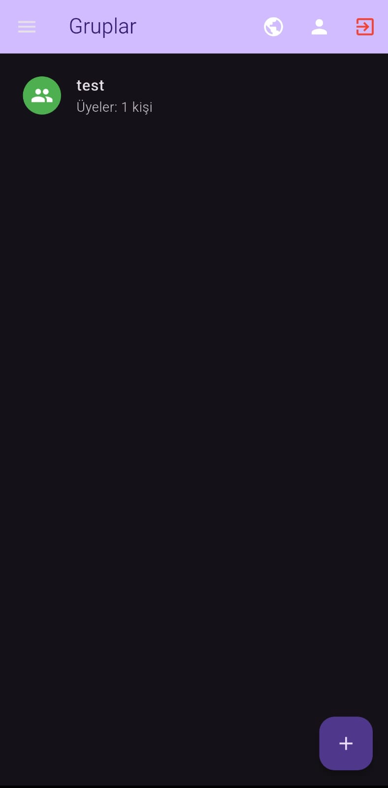
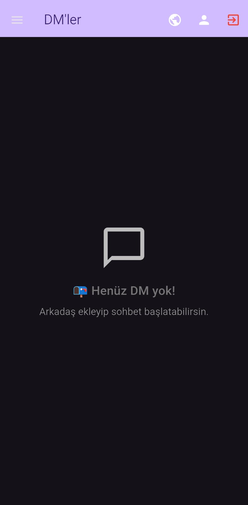
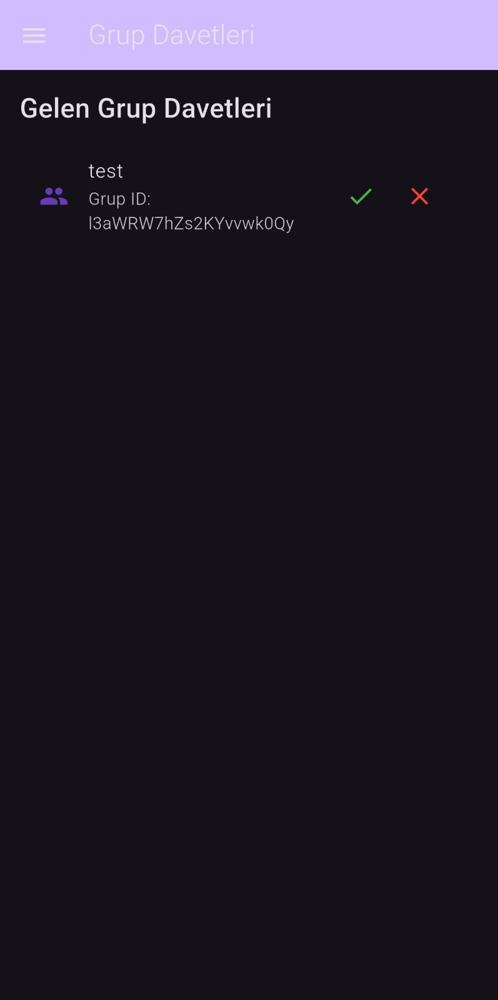
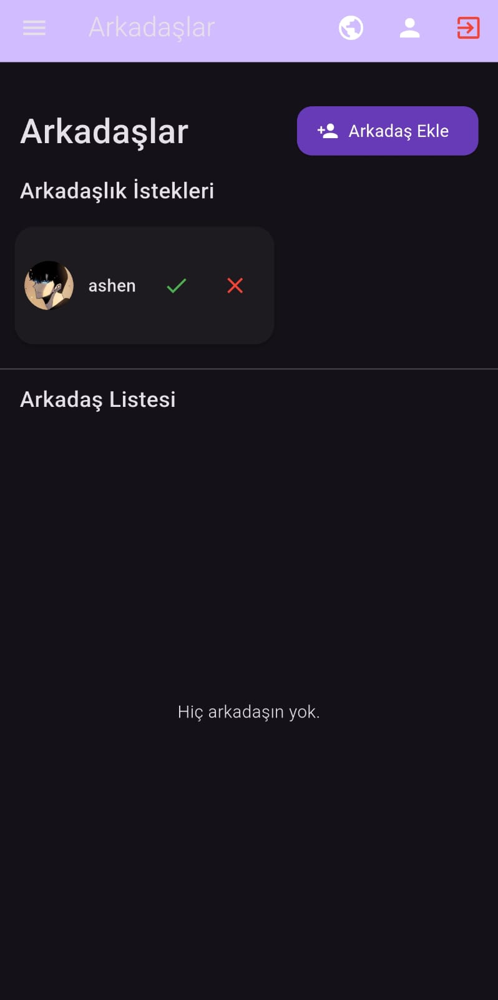
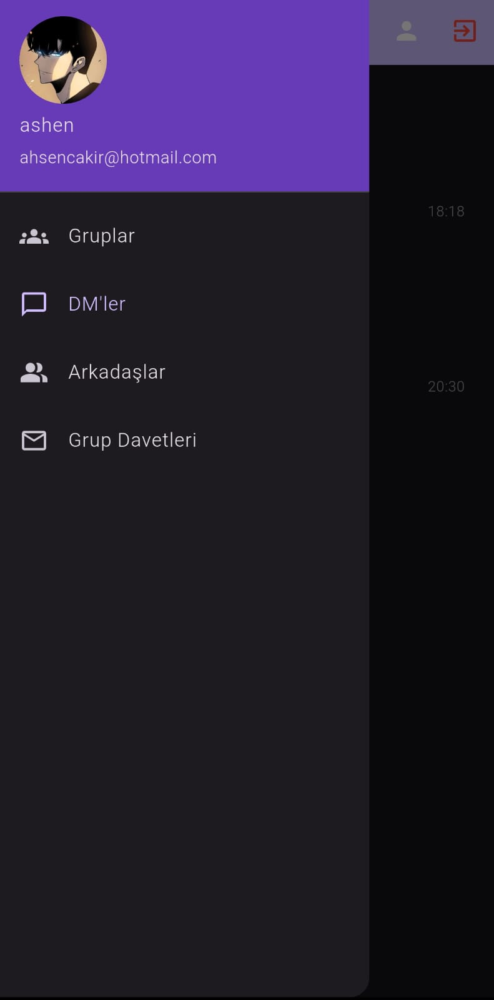

# Mockers Chat - Gerçek Zamanlı Sohbet Uygulaması

Mockers Chat, Flutter ile geliştirilmiş, kullanıcıların gerçek zamanlı olarak sohbet edebilediği, bildirimler alabildiği ve grup davetleri gönderebildiği modern bir mesajlaşma uygulamasıdır. Firebase Authentication ile kullanıcı yönetimini, Firestore ile sohbet ve grup verilerini, Firebase Storage ile medya depolamayı ve Firebase Cloud Messaging ile push bildirimleri desteklemektedir.

## Projenin Amacı

Kullanıcıların gerçek zamanlı sohbet edebilediği, dinamik grup yönetimi, çevrim içi durumu izleme, okunmamış mesaj sayacı, tema desteği ve kullanıcı profili özelleştirme gibi özellikler sunan modern bir mesajlaşma platformu oluşturmak hedeflenmiştir.

## Teknik Detaylar

- **Flutter**: Uygulama geliştirme platformu  
- **Firebase Authentication**: Kullanıcı kimlik doğrulama ve yönetimi  
- **Firestore**: Gerçek zamanlı sohbet ve grup verileri  
- **Firebase Storage**: Medya dosyaları ve profil fotoğrafları  
- **Firebase Cloud Messaging**: Push bildirimleri  
- **Provider**: Durum yönetimi  
- **HTTP**: API istekleri için  

## Öne Çıkan Özellikler

- 💬 Gerçek zamanlı sohbet  
- 👥 Dinamik grup yönetimi ve davet sistemi  
- 📱 Push bildirim desteği  
- 🟢 Çevrim içi durumu izleme  
- 📊 Okunmamış mesaj sayacı  
- 🌐 Koyu/açık tema seçeneği  
- 📷 Medya paylaşımı ve profil fotoğrafı  
- 👤 Kullanıcı profili özelleştirme  

## Kullanılan Teknolojiler

- Flutter  
- Firebase Authentication & Firestore  
- Firebase Storage  
- Firebase Cloud Messaging  
- Provider  
- Flutter Local Notifications  

## Sayfalar ve Görevleri

### 1. Giriş Sayfası (`login_screen.dart`)
- Firebase Authentication ile e-posta/şifre girişi  
- Kullanıcı doğrulama ve Firestore'dan profil verilerini çekme  

### 2. Kayıt Sayfası (`register_screen.dart`)
- Yeni kullanıcı hesabı oluşturma  
- Firebase Authentication ve Firestore'a kullanıcı bilgilerini kaydetme  

### 3. Ana Sayfa (`home_screen.dart`)

- Kullanıcının katıldığı grupların listesi  
- Grup oluşturma ve katılma seçenekleri  
- Gerçek zamanlı grup güncellemeleri  

### 4. Sohbet Sayfası (`group_chat_screen.dart`)
- Gerçek zamanlı mesajlaşma  
- Medya paylaşımı ve dosya gönderme  
- Mesaj durumu göstergeleri  

### 5. Direkt Mesaj Sayfası (`dm_chat_screen.dart`)

- Bire bir özel mesajlaşma  
- Çevrim içi durumu gösterimi  
- Okundu bilgisi  

### 6. Grup Oluşturma (`create_group_screen.dart`)
- Yeni grup oluşturma arayüzü  
- Grup adı ve açıklama belirleme  
- İlk üyeleri davet etme  

### 7. Grup Davetleri (`group_invites_screen.dart`)

- Gelen grup davetlerini görüntüleme  
- Davetleri kabul etme/reddetme  
- Davet durumu bildirimleri  

### 8. Arkadaşlar Sayfası (`friends_screen.dart`)

- Arkadaş listesi ve çevrim içi durumları  
- Yeni arkadaş ekleme  
- Direkt mesaj başlatma  

### 9. Profil Sayfası (`profile_screen.dart`)
- Kullanıcı bilgilerini görüntüleme ve düzenleme  
- Profil fotoğrafı güncelleme  
- Hesap ayarları ve çıkış  

### 10. Kullanıcılar Sayfası (`users_screen.dart`)
- Tüm kullanıcıları görüntüleme  
- Arkadaş ekleme ve grup davet etme  
- Kullanıcı arama ve filtreleme  

### 11. Grup Detayları (`group_details_screen.dart`)
- Grup bilgileri ve üye listesi  
- Grup ayarları ve yönetimi  
- Üye ekleme/çıkarma yetkileri  

### 12. Drawer Menü

- Navigasyon menüsü  
- Hızlı erişim linkleri  
- Kullanıcı profil bilgileri  

## Firebase Entegrasyonu

- **Firebase Authentication**: Giriş/kayıt/oturum yönetimi  
- **Firestore**: Mesajlar, gruplar ve kullanıcı verileri  
- **Firebase Storage**: Profil fotoğrafları ve medya dosyaları  
- **Firebase Cloud Messaging**: Push bildirimleri  

## Modüler Yapısı

- `services/auth_service.dart`: Kimlik doğrulama işlemleri  
- `services/chat_service.dart`: Mesajlaşma ve grup yönetimi  
- `services/notification_service.dart`: Push bildirim yönetimi  
- `models/`: Veri modelleri (User, Group, Message)  
- `widgets/`: Ortak UI bileşenleri  
- `theme_manager.dart`: Tema yönetimi  

## Geliştirme Ortamı

- Flutter SDK  
- Firebase CLI  
- Android Studio  
- Visual Studio Code  

## İletişim

Proje geliştiricileri: **Ahsen Çakır**

## Kurulum

1. Flutter SDK'yı yükleyin
2. Firebase projesi oluşturun ve yapılandırın
3. Bağımlılıkları yükleyin:
```bash
flutter pub get
```
4. Uygulamayı çalıştırın:
```bash
flutter run
```
